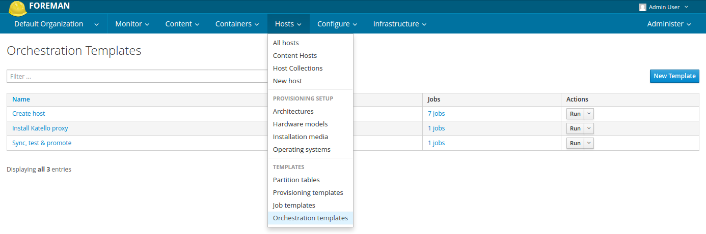
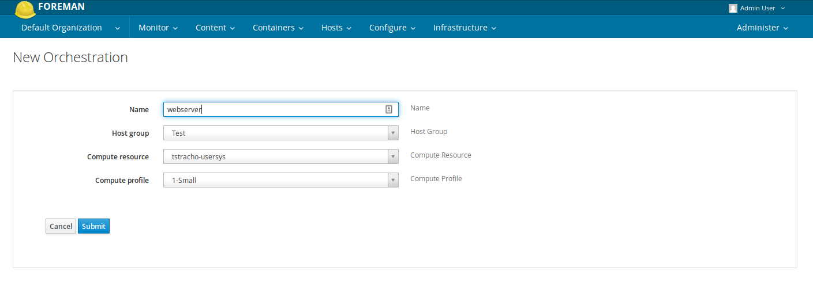
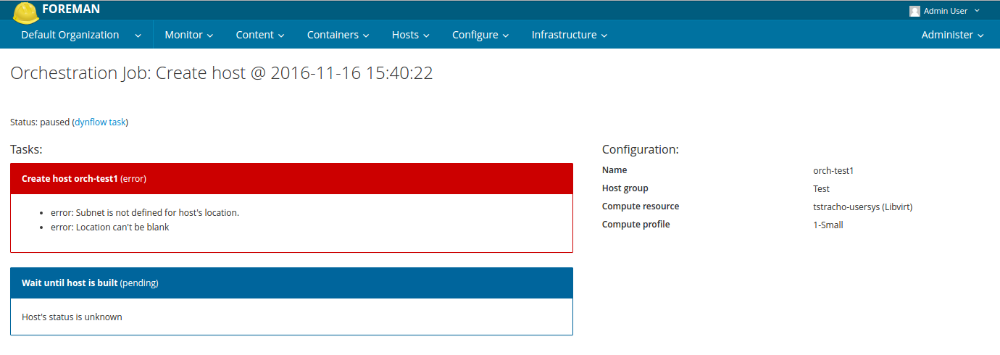
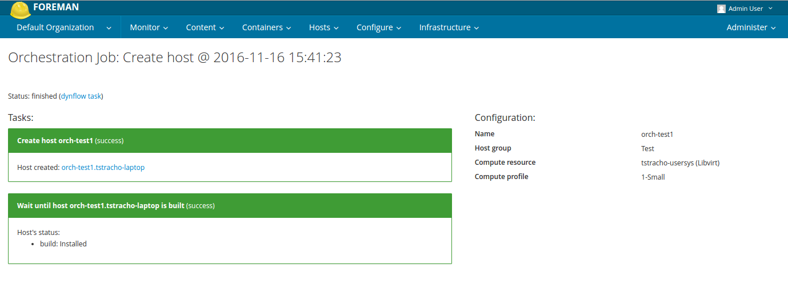

# Foreman Orchestration Templates

Templated and configurable multi-host orchestration jobs for the Foreman.




## TOC
* [Orchestration templates](#orchestration-templates)
* [Template methods](#template-methods)
* [Input types](#input-types)
* [Installation](#installation)


## Orchestration templates

This Foreman plugin enables writing orchestration scripts in ruby. Template describes actions to be taken in the Foreman and can define inputs, that are rendered into a form before the orchestration job is triggered to collect configuration values from the user.

```ruby
# Example template: Create a new host
name = input(:name, :description => 'Name')
hg = input :host_group, :description => 'Host Group', :type => :select_resource, :resource => 'Hostgroup'
cr = input :compute_resource, :description => 'Compute Resource', :type => :select_resource, :resource => 'ComputeResource'
cp = input :compute_profile, :description => 'Compute Profile', :type => :select_resource, :resource => 'ComputeProfile'

host_params = {
    :name => name,
    :compute_resource => cr,
    :compute_profile => cp,
    :hostgroup => hg
}

new_host = create :host, :parameters => host_params  # Create new host
new_host.built                                       # And wait until it's built
```



When the configuration is ready, the user can trigger the orchestration job. Template + the configuration is then used to plan actions whose progress can be tracked at the job detail page.

Orchestration templates recognize dependencies between inputs and outputs of actions. If possible, actions are executed in parelel.




Each template is recipe for [dynflow's](http://dynflow.github.io/) plan action. Together with power of this workflow engine this brings in some limits. Some template methods plan dynflow actions and therefore their output isn't immediately available. Such method return output reference object instead. Dynflow uses the output references for ordering of actions and dependency calculation and it will handle correct injection of output values for you once they're available.

Please note that this approach limits usage of using conditions or loops in the templates:
```ruby
os_name = 'Arch'
os = create(:operatingsystem, :parameters => { :name => os_name })

# The following condition will be evaulated as false,
# because os[:object][:name] is a dynflow reference when
# the template is being processed
#
# os[:object][:name].class
# > Dynflow::ExecutionPlan::OutputReference
#
if (os[:object][:name] == os_name)
  # This won't be executed
end

```


## Template methods

### create(resource_type, options)
Creates new resource in the Foreman.

Returns reference to output of the task that handles creation of the resource. The output contains attributes of the just created object
in `output[:object]`.

When hosts are created the output is enhanced with two additional methods `configured` and `built`. Calling this methods will plan
additional task that waits until the host's configuration status "active" or "no changes" or build status is "installed".

**Parameters:**

* `resource_type(string or symbol)`
type of the resource to create in camel case
* `options(hash)`
  * `parameters(hash)`
  hash of attributes for the new resource

**Example:**
```ruby
host_params = {
  :name => input(:name),
  :compute_resource => input(:compute_resource, :type => :select_resource, :resource => 'ComputeResource'),
  :hostgroup => input(:host_group, :type => :select_resource, :resource => 'Hostgroup')
}
new_host = create(:host, :parameters => host_params)
configured_host = new_host.configured

execute(:on => configured_host #...
```


### current_organization
Returns current organization selected in the UI.


### current_location
Returns current organization selected in the UI.


### execute(options)
Plans execution of a script on a host or set of hosts via remote execution.
This method allows to execute either existing remote execution template or a script defined in `:script` parameter.
A new template is created from contents of `:script` in the latter case.

Requires [remote execution plugin](https://github.com/theforeman/foreman_remote_execution) to be installed and configured.

**Parameters:**

* `options(hash)`
  * `:on(integer, string or array)`
  host id or name to execute the script on, can be array of such values
  * `:script(string)`
  script that should be executed on the host
  * `:name(string)`
  name for the script, it's used for the script template
  * `:template_id(integer)`
  id of the template to execute
  * `:inputs(hash)`
  inputs for the script, use erb syntax to get the value in the script `<%= input("input_name") %>`

**Example:**
```ruby
inputs = {
  :version => '1.13',
  :os => 'el7',
}
execute :on => host_id, :name => 'Add foreman repos', :inputs => inputs, :script => <<-TPL
  yum -y localinstall http://yum.theforeman.org/releases/<%= input("version") %>/<%= input("os") %>/x86_64/foreman-release.rpm
TPL
```

### find(resource_type, search_attributes)
Returns first resource matching `search_attributes` or nil if nothing is found.

**Parameters:**

* `resource_type(string or symbol)`
type of the resource to find, in camel case
* `search_attributes(hash)`
hash of attributes to look for

**Example:**
```ruby
local_subnet = find(:subnet, :name => 'localhost')
```


### foreman_server_fqdn
Returns fully qualified domain name of the foreman server from settings.


### input(name, options)
Defines new input for the orchestration template.

Returns value from the configuration form.

**Parameters:**

* `name(string or symbol)`
Unique identifier for the input
* `options(hash)`
  * `:type(string or symbol)`
  type of the input, see section [Input types](#input-types) for more details
  * `...`
  additional input type dependent options


### sequence(&block)
Ensures that actions in the block are executed in sequence.

**Example:**
```ruby
sequence do
  create(:architecture, #...
  create(:operatingsystem, #...
end
```

## Input types

Common options:
* `:label`
label that is used in the configuration form
* `:description`
detailed description of the field

### text


**Additional options:**
* `:default_value`
default value for the text field


### select_resource


**Additional options:**
* `:resource`
camel case name of the resource to select
* `:filter`
filter in scoped search syntax to limit the selection

## Installation

Add `gem 'foreman-orchestration-templates', path: '../foreman-orchestration-templates'` to your `Gemfile.local.rb` file.
For more information see
[How to Install a Plugin](http://projects.theforeman.org/projects/foreman/wiki/How_to_Install_a_Plugin).


## Copyright

Copyright (c) 2016 Red Hat Inc

This program is free software: you can redistribute it and/or modify
it under the terms of the GNU General Public License as published by
the Free Software Foundation, either version 3 of the License, or
(at your option) any later version.

This program is distributed in the hope that it will be useful,
but WITHOUT ANY WARRANTY; without even the implied warranty of
MERCHANTABILITY or FITNESS FOR A PARTICULAR PURPOSE.  See the
GNU General Public License for more details.

You should have received a copy of the GNU General Public License
along with this program.  If not, see <http://www.gnu.org/licenses/>.


